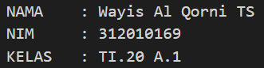

# projectpratikum
# Tugas ini untuk melengkapi pertemuan ke 6<br> 

#Dan menjelaskan project<br> 


**Nama  :Wayis Al Qorni TS**<br> 
**Nim   :312010169**<br> 
**Kelas :TI.A1.20** <br>
**Tugas :Bahasa Pemrogramman**<br>

# Pertemuan 5 - Tugas<br>

Pada pertemuan 5 Bahasa Pemrograman saya akan membuat Aplikasi Biodata Python (seperti Gambar dibawah ini) 


Saat ini saya akan menjelaskan hasil dari tugas tersebut. 
Berikut source code nya atau Klik Link berikut (pertemuan5 python):


print("==============================") <br>
print("= NAMA    : Wayis Al Qorni TS ") <br>
print("= NIM     : 312010169         ") <br>
print("= KELAS   : TI.20 A.1         ") <br>
print("==============================") <br>

`print("Please enter your full name : Wayis Al Qorni TS")` <br> 
`fullname=input()` <br>
`print("Please enter nickname : Wayis")` <br> 
`nickname=input()` <br>
`print("Please enter your NPM : 312010169")` <br> 
`npm=input()` <br>
`print("Please enter place of birth : BEKASI")` <br> 
`pob=input()` <br>
`print("Please enter date of birth : 19")` <br> 
`date=input()` <br>
`print("Please enter your month of birth : Februari")` <br> 
`month=input()` <br>
`print("Please enter year of birth : 2001")` <br> 
`year=input()` <br>
`print("Please enter your phone number : 08210142289")` <br>
`phone=input()` <br>
`print("Please enter your address : Kp.Rawa julang")` <br> 
`address=input()` <br>

`dob=input("2020-year")` <br>

`print("\n\n Assalamu'alaikum. ")` <br>
`print("f\n Let me introduce my self, my name is {Wayis Al Qorni TS}, but you can call me {Wayis}, my NPM {312010169}, I was born in {BEKASI} and iam {2020} years old, I am very glad if you want to invite my house in {Kp.Rawa julang}, So don't forget to call me before with the number {08210142289}, \n\n Thanks you very much ")` <br>
Berikut Penjelasannya :

print("please enter your full name : ") <br>
``` <br>
Source code diatas berfungsi untuk mencetak hasil / output berupa **Please enter your full name :** ". <br>
 Untuk menampilkan output string, saya menggunakan *tanda petik dua* didalam fungsi print(), sedangkan jika saya ingin menampilkan output atau hasil berupa angka atau interger saya tidak perlu menggunakan *tanda petik dua*. Contohnya : <br>

``` 

print("Nama saya adalah...") <br>
print(1234567) <br>

(Seperti gambar dibawah ini)



* Untuk source code berikutnya adalah inputan atau membuat variable. seperti syntax dibawah ini :

`fullname=input()` <br>
``` <br>
**Keterangan** : <br> 
`>Variable adalah sebuah wadah penyimpanan data pada program yang akan akan digunakan selama program itu berjalan. yang berfungsi sebagai variable dalam source code diatas adalah **fullname** . <br>
`>Fungsi **input()** adalah untuk memasukan nilai dari layar console di command prompt, lalu kemudian mengembalikan nilai saat kita menekan tombol enter *(newline)* <br> 
`*(newline)*` <br>

[poto](poto/input.png)<br>

pada gambar di atas, hasil dari inputan tersebut berwarna *hijau* <br>

* Untuk memasukan perintah lain seperti *Nikname, NPM, Place Of Birth, Date Of Birth, Year Of Birth, Phone Number, and Addres* mengikuti perintah sama seperti memasukan *fullname* <br>

* Untuk menghitung rumus saya menggunakan variable *DOB* yaitu 2020 (Tahun sekarang) dikurangin dengan Year of Birt, pada source code berikut : <br>
``` python 


dob=input("2020-year") <br>


``` <br>
Pada syntax/source diatas, saya menggunakan variable (dob) dimana untuk menghitung umur (variable **age** pada output), yaitu dengan rumus pada variable *dob=input("2020-year")* <br>

* langkah kali ini saya akan menampilkan output yang diminta oleh dosen.output pertama yang diminta Dosen adalah menampilkan salam, yaitu dengan mengetikkan syntax/source code berikut : <br>

``` python
print("\n\n Assalamu'alaikum. ")` <br>
``` <br>

``` 

Keterangan : <br>
1. Fungsi **\n** pada source code di atas adalah untuk memberi baris baru / enter / *(newline)* <br>

2. Fungsi print() seperti dijelaskan pada point **Output** diatas
Hasil dari source code diatas adalah seperti gambar dibawah ini : <br>


print(f"Let me introduce my self, my name is {fullname}, but you can call me {nickname}, my NPM {npm}, I was born in {pob} and iam {dob} years old, I am very glad if you want to invite my house in {address}, So don't forget to call me before with the number {phone}, \n\n Thanks you ")

Keterangan :

* Fungsi huruf f pada perintah print(f"....") adalah fungsi print atau bisa memudahkan programer dalam mencetak statement dalam satu baris dibandingkan dengan metode yang lama yaitu memisahkan string dan variable dengan simbol koma( , ) atau plus ( + )
* sedangkan fungsi {} pada output tersebut adalah untuk menampilkan hasil dari variable
Hasil dari output tersebut seperti berikut :


# Pertemuan 6 - Lab 1

Pada halaman ini (Tugas Pertemuan 6 - Lab 1) saya diberikan tugas oleh Dosen yaitu mempelajari operator aritmatika menggunakan bahasa Pemrograman pyhton. Berikut source code yang di berikan oleh dosen : 

#penggunaan end
print('A', end='')
print('B', end='')
print('C', end='')
print()
print('X')
print('Y')
print('z')

#penggunaan separator

`w, x, y, z = 10, 15, 20, 25`
`print(w, x, y, z)`
`print(w, x, y, z, sep=',')`
`print(w, x, y, z, sep='')`
`print(w, x, y, z, sep=':')`
`print(w, x, y, z, sep='.....')`

Oke, kali ini saya akan menjelaskan tentang materi yang di berikan oleh Dosen.

* Penggunaan END Penggunaan end digunakan untuk menambahkan karakter yang dicetak di akhir baris. secara default penggunaan end adalah untuk ganti baris. 

`print('A', end='')`
`print('B', end='')`
`print('C', end='')`
> Penggunaan print () digunakan untuk mencetak output, seperti syntax dibawah ini :

`print()`
>Syntax dibawah ini digunakan untuk menampilkan output berupa string

`print('X')`
`print('Y')`
`print('z')`

Hasil dari source code tersebut seperti gambar dibawah ini :


* Penggunaan separator
>Pendeklarasian beberapa variable beserta nilainya

w,x,y,z=10,15,20,25
>Menampilkan hasil dari variable tiap-tiap variable

`print(w,x,y,z)`
>Menampilkan hasil dari tiap-tiap variable dengan menggunakan pemisah : (koma)

`print(w,x,y,z,sep=",")`
>Menampilkan hasil dari tiap-tiap variable dengan menggunakan pemisah

`print(w,x,y,z,sep="")`
>Menampilkan hasil dari tiap-tiap variable dengan menggunakan pemisah : (titik dua)

`print(w,x,y,z,sep=":")`
>Menampilkan hasil dari tiap-tiap variable dengan menggunakan pemisah

`print(w,x,y,z,sep="-----")`

* hasil dari syntax / source code diatas adalah seperti berikut ini : 