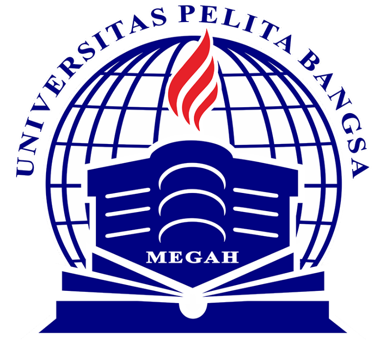

# projectpratikum
#Tugas ini untuk melengkapi pertemuan ke 6 

#Dan menjelaskan project 

**Nama  :Wayis Al Qorni TS** 
**Nim   :312010169** 
**Kelas :TI.A1.20** 
**Tugas :Bahasa Pemrogramman**

#Pertemuan 5 - Tugas 

Pada pertemuan 5 Bahasa Pemrograman saya akan membuat Aplikasi Biodata Python (seperti Gambar dibawah ini)